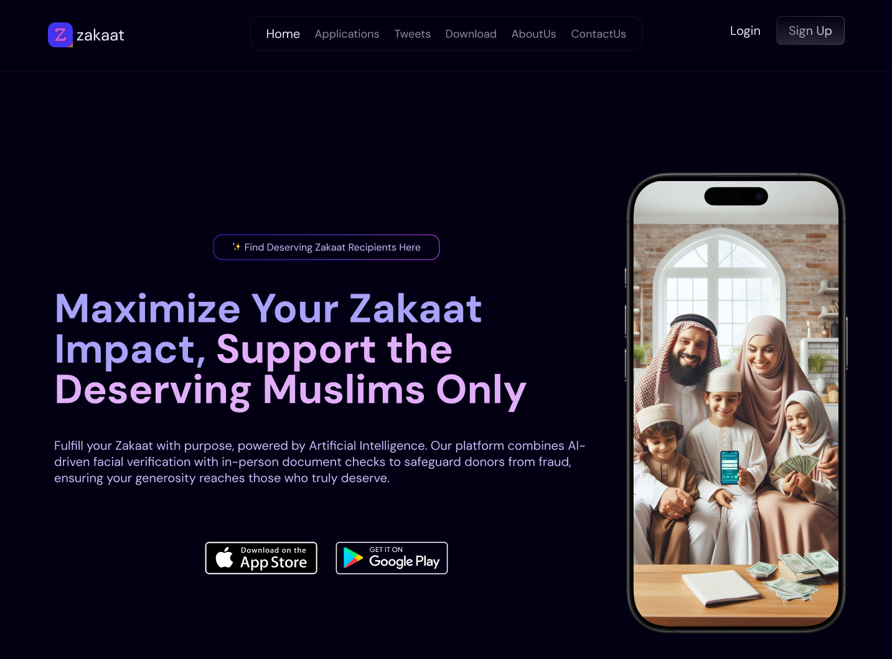
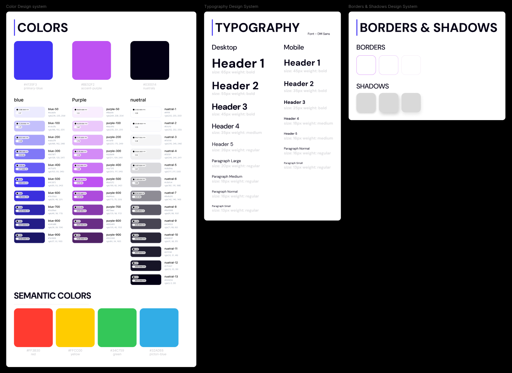
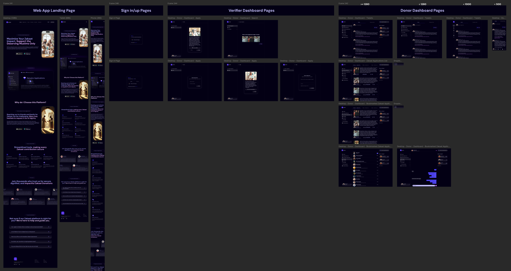
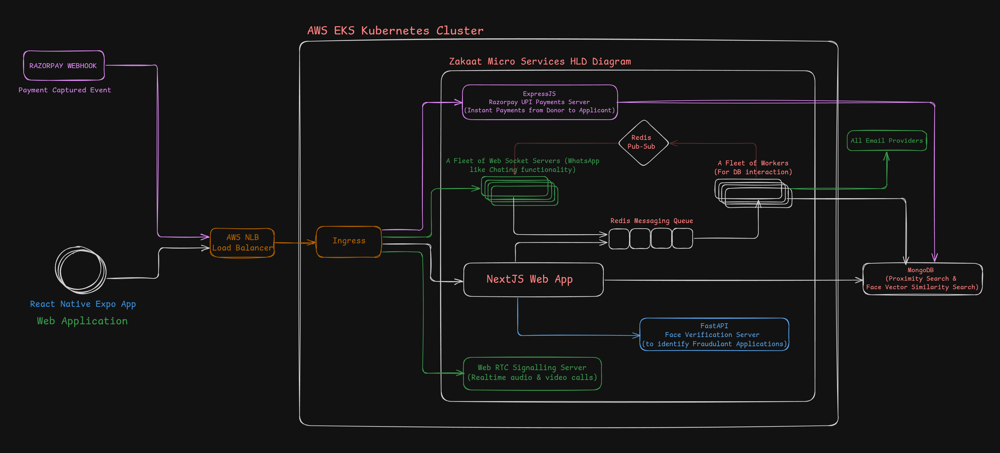

# 🤝 Zakaat: Connecting Donors with the Truly Deserving Applicants

_A Turborepo-based, 6-Microservice Web App_

👋 **Hey there!**  
I'm Sadiq Vali, a Computer Vision Deep Learning Engineer turned Figma UI Designer, Full-Stack Web Developer, React Native Mobile Dev, and budding DevOps Engineer.

Recently, I built something close to my heart—**Zakaat**, a platform that directly connects donors with those in genuine need, without middlemen or delays.

This README walks you through the journey, design, architecture, tech stack, and key user flows that make Zakaat a one-of-a-kind solution.

---

## 🚀 Why Zakaat?

Charity often gets lost in middlemen, lack of trust, and delayed impact.  
**Zakaat changes that**—inspired by Islamic giving principles and powered by modern tech.

### 💡 How it works:

- Donations go directly to applicants' bank accounts—**no platform cut**
- Instant transfers—powered by **UPI & Razorpay**
- Borderless support—including for global causes like Gaza relief

✅ **No middlemen**  
✅ **No delays**  
✅ **No hidden fees**

---

## 🎨 Design System From Figma, With Love

I crafted the entire UI/UX from scratch for both web and mobile apps using **Figma**.

### 🎨 Highlights:

- Custom typography, color palette, and glassmorphism styling
- Modular components with structured variants & properties
- Smart, responsive layouts using `clamp()`
- Prototypes with real user interaction flows
- Figma Wrap used for consistency & automation

💬 **It's more than pretty—it's scalable, structured, and developer-first.**

🔗 **Explore the Figma Design:**  
[Figma Link](https://www.figma.com/design/VO5aSBXfFWmi5T31LDIQs3/HaqqueZakat?node-id=1215-10091&t=P4iG4ypETgXvG2Ih-1)

---

## ⚙️ Tech Stack Built for Speed and Scale

**Frontend:** Next.js 15, TypeScript, TailwindCSS, Zustand, Shadcn, Magic UI

**Backend:** FastAPI, Prisma ORM, MongoDB, AuthJS v5, Zod, UploadThing

**Infra:** TurboRepo, Docker, K8s (AWS EKS), Helm, ACM, NGINX + NLB

**Real-time:** WebSockets, Redis, PeerJS, Nodemailer, React Email

**Payments:** Razorpay + Instant webhook-based capture

**AI/Fraud:** DeepFace + FAISS for face similarity search

🚀 **Built with Bun** for blazing-fast dev workflows

### 🧠 Coming Soon:

- TRPC, Stripe/PayPal
- React Native Expo
- React Query + TanStack Router
- AI-powered recommendations
- Golang for performance-critical services

---

## ✨ Highlights of this Project

- **Twitter-style tweeting**
- **WhatsApp-style chat** with real-time messaging
- **Omegle-style video calling** using PeerJS
- **Face verification** for fraud detection (Computer Vision + Deep Learning)
- **Face embedding similarity search** using native MongoDB Atlas
- **Proximity-based search** natively supported by MongoDB's geo queries
- **Instant UPI payments** via Razorpay, fully automated using webhooks
- **Seamless scrolling-based pagination**—no jarring page reloads

---

## 🔄 Core User Flows

### 1️⃣ **Fluid Responsive UI & Onboarding New User**

- Using `clamp()` for adaptive layouts (no media queries, just smooth scaling).
- Personalized onboarding email sent automatically via AuthJS v5.

[▶ Watch Demo on Loom](https://www.loom.com/share/dc7e6fa17a6a470382eeff9331fad3e8?sid=7b9d0876-d655-4450-a4a8-d968e07deb8e)

### 2️⃣ **Apply for Zakaat (Deep Learning, Computer Vision, Siamese Models, FAISS)**

- Face verification using Siamese models.
- Duplicate detection ensures only genuine applicants proceed.
- **Powered by FAISS**—handles millions of faces in under 2–3 seconds.
- **Accuracy:** 98.56% Top-4 tested on a high-variance dataset.

[▶ Watch Demo on Loom](https://www.loom.com/share/3fcd737c51314655922979eecae8fe75?sid=ddfcabc8-0642-4742-8476-a3bd32c4e625)

### 3️⃣ **Proximity Search & Bookmark/Unbookmark Applications**

- Discover local applicants using **MongoDB Atlas geo-queries**.
- Bookmark applications for later donations.

[▶ Watch Demo on Loom](https://www.loom.com/share/8c8f92e97b4744aba9b9d2886de57b17?sid=710d61db-0c96-4b42-b75c-489fc0228a18)

### 4️⃣ **Real-time Chat like WhatsApp**

- Secure, private messaging—no phone numbers exchanged.

[▶ Watch Demo on Loom](https://www.loom.com/share/5a67806f5c65487faa3512c109c74825?sid=53c6805a-495b-4c36-bdee-f432f7c63a31)

### 5️⃣ **Video Calls Like Omegle**

- Private video calls using **PeerJS + WebRTC**.
- Only donors can initiate; applicants accept/reject.

[▶ Watch Demo on Canva](https://www.canva.com/design/DAGnHWSaWZ0/DMWkDE9GQO5iRslv-A-jKQ/watch?utm_content=DAGnHWSaWZ0&utm_campaign=designshare&utm_medium=link2&utm_source=uniquelinks&utlId=hef0d90a6d4)

### 6️⃣ **Instant UPI Donations**

- Razorpay handles transactions via webhooks.
- Donors receive instant thank-you notes.

[▶ Watch Demo on Loom](https://www.loom.com/share/eec491c5df4040d8ade21cb2081af885?sid=67e3eb91-b179-4373-9e20-92eea8e81533)

### 7️⃣ **Donor Tweets**

- Social endorsements to build trust.

[▶ Watch Demo on Loom](https://www.loom.com/share/a268385d75684ec6b18e3c45eb6542d0?sid=fe86f32a-ed15-4d3f-8637-9336e296f0a0)

### 8️⃣ **Scrolling-Based Pagination**

- Infinite scrolling for a native app-like experience.

[▶ Watch Demo on Canva](https://www.canva.com/design/DAGnHuPdfTU/iTocr0CfPHoctKtxHN04mw/watch?utm_content=DAGnHuPdfTU&utm_campaign=designshare&utm_medium=link2&utm_source=uniquelinks&utlId=h50618d5dbb)

---

## 🌍 Explore the Platform

🔗 **Live Demo:** [zakaat.sadiqvali.in](https://zakaat.sadiqvali.in)  
_(Note: If temporarily down, it's likely due to high operational costs.)_

📌 **Connect with me:**

- 🐦 **Twitter/X:** [@rebirth4vali](https://x.com/rebirth4vali)
- 💼 **LinkedIn:** [Sadiq Vali](https://www.linkedin.com/in/sadiq-vali/)
- 💻 **GitHub:** [SadiqVali786/zakaat-micro-services](https://github.com/SadiqVali786/zakaat-micro-services)

✨ **If this project inspired you, let's connect!** Whether for collaboration, contribution, or just to share thoughts—I'm always up for meaningful conversations around tech and impact.

— **Sadiq Vali** 🙏
