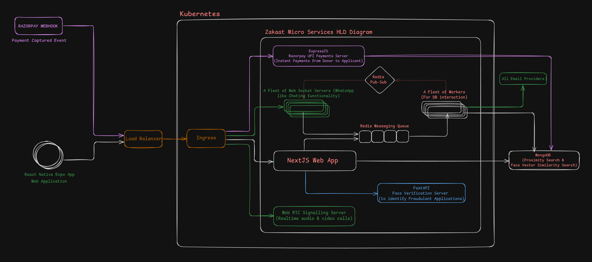

# Zakaat Mobile(Android, iOS) & Web App

## Description

A Zakaat distribution web app that connects donors with verified, deserving individuals in their locality and among relatives who may hesitate to ask for help. Using AI to prevent fraud, the platform ensures Zakaat reaches those truly in need. Donors can support friends or relatives if they’re registered, while applicants can stay anonymous or share details to build trust.

### Figma UI/UX Design Live Link

<https://www.figma.com/design/VO5aSBXfFWmi5T31LDIQs3/HaqqueZakat?node-id=80-18620&t=n6i2BK4lvv9QF8oc-1>

### Landing Page Sneak Peak

## Techologies Used

1. **Web-App:** Next.js 15, Typescript, Tailwindcss
1. **Mobile-App(Android, iOS):** React Native Expo
1. **Computer Vision AI:** Siamese Network for Fraud Detection via Face Verification (98.56% accurate)
1. **NLP & Gen AI:** For Text Summarization
1. **UI/UX Design:** Figma
1. **Database:** Prisma ORM, MongoDB
1. **Authentication:** NextAuth's Google Authentication
1. **Contanerization:** Docker
1. **Proximity Search:** Native MongoDB spherical $geoNear location API with pipeline
1. **Deployment:** Kubernetes
1. **Chatting:** Web-Sockets
1. **Audio & Video Calls:** Web-RTC
1. **Miscelleneous:** useActionState, useOptimistic, revalidatePath, Server Components within a Client Components, Semantic Tags, Query Parameters instead of useState, Modular Components & Code
1. **Component Libraries:** Shadcn, Aceternity, MagicUI
1. **Cloud-based Media Management Platform:** Cloudinary
1. **Frontend State Management:** Zustand

## Features in this Application

1. ⏱️ Realtime Chatting between Donors and Applicants
2. 🟢 Realtime Video Calls between Donors and Applicants
3. 🤑 Fraud Zakaat Application Elimination with Face Verification
4. 🚨 Fetching Applications Geographically nearest to the donors by using GPS coordinates
5. 🔐 Custom Authentication
6. 📚 Websockets
7. 📣 Optimistic UI
8. 📱 Responsive design
9. 👾 Deployment
10. 👨‍👨‍👧‍👦 Real-time Collaboration
11. 🤯 Suggesting Zakaat Applications to fellow donors in your Network
12. 😜 Bookmarking Applications
